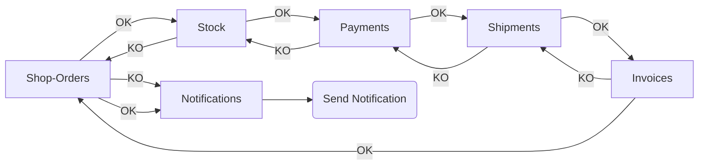

# Choreography Microservices

Event-Driven Microservices with Kafka and Choreography as the consistency pattern

## Why

This was a laboratory for the High-Potential Technical Booster hosted at EDEM and sponsored by Capgemini

### Source

https://github.com/ccsw-csd/shop-cart-public

### Reference

https://github.com/ccsw-csd/shop-cart

## Data Flow



## Structure

- scripts, e2e testing
- server, kafka and zookeeper, WIP
- src, microservices

## Language Philosophy

Trying not to default to Java, each microservice is written in a different language

- Ruby -> shop_orders
- C# -> stocks
- Golang -> payments
- PHP -> shipments
- Python -> invoices
- Node -> notifications

## Testing

Each microservice owns their own testing strategy.
The payloads are defined in the microservice, as a json file

There's a root script to execute every single e2e testing of each microservice in order

## Handlers

```java
class ServiceHandler {
    public ShopOrderRequest shopOrderRequest;

    // ...

    public void success() {

    }

    public void fail() {

    }

    public void process() {

    }
}
```
